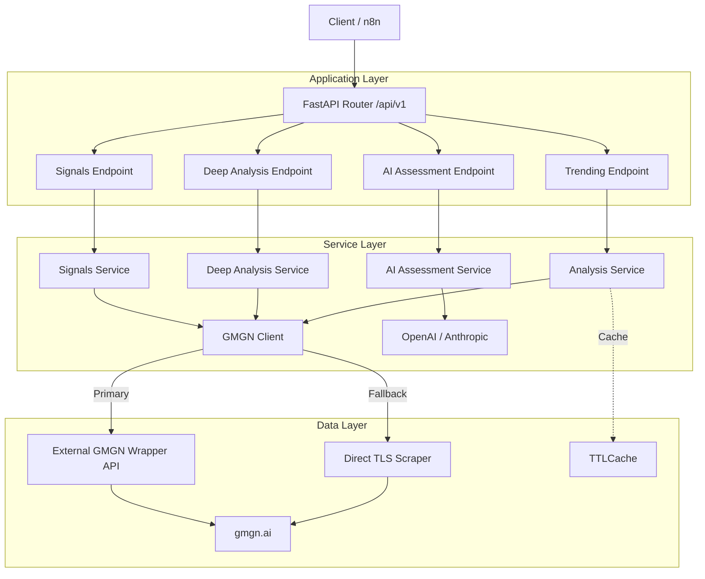
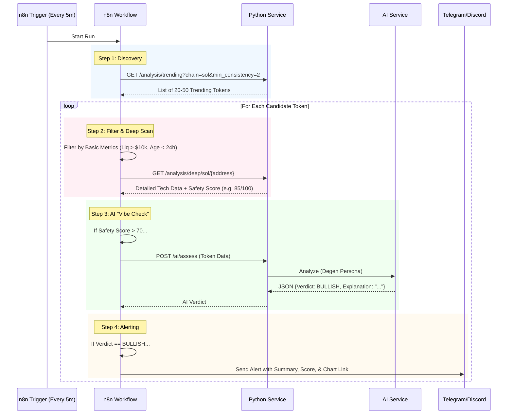

# GMGN Trending Service - Architecture & Developer Guide

This document provides a comprehensive technical overview of the **GMGN Trending Service**. It is designed for developers and AI agents to understand the system's holistic design, data flows, and integration points.

## 1. System Overview

The GMGN Trending Service is a **Multi-Chain Crypto Analytics Backend** built with Python (FastAPI). Its primary purpose is to aggregate, analyze, and score trending tokens from [gmgn.ai](https://gmgn.ai) to identify potential trading opportunities ("gems") before they moon.

**Key Capabilities:**
*   **Multi-Chain Support**: Solana (`sol`), Ethereum (`eth`), Base (`base`), BSC (`bsc`).
*   **Hybrid Data Fetching**: Uses a mix of an external API wrapper and direct `tls-client` scraping with intelligent fallbacks.
*   **Deep Analysis**: Aggregates market data, security flags, and holder distribution to calculate an adaptive "Safety Score".
*   **AI Assessment**: Integrates OpenAI/Anthropic to generate "degen-style" qualitative verdicts.
*   **Signal Detection**: Scans for specific patterns like "Pump.fun Graduation", "Early Gems", and "High Momentum".

---

## 2. High-Level Architecture

The system follows a layered service architecture.

### Key Components

1.  **`app/main.py`**: Entry point. Initializes FastAPI and Middleware.
2.  **`app/services/gmgn.py` (`GMGNClient`)**: The core data access layer.
    *   **Primary Strategy**: Calls an external API wrapper (hosted service) for stability.
    *   **Fallback Strategy**: If the wrapper fails (common on BSC/ETH for specific details), it attempts to scrape `gmgn.ai` directly using `tls_client` to mimic a real browser (Chrome/Safari) and bypass WAFs.
3.  **`app/services/deep_analysis_service.py`**:
    *   Aggregates data from multiple GMGN endpoints (Token Info, Security, Top Buyers).
    *   Implements the **Adaptive Safety Score** algorithm (0-100) which weighs Liquidity, Holder Count, Age, Security Flags, and Whale Concentration.
4.  **`app/services/ai_assessment_service.py`**:
    *   Constructs a prompt with all gathered technical data.
    *   Requests a structured JSON response from the LLM (Verdict, Risk Level, Explanation).

---

## 3. N8N Integration Workflow

This service is the "Brain" of an automated trading/alerting pipeline orchestrated by **n8n**.

### The "100x Gem Finder" Flow

### Workflow Logic
1.  **Discovery**: Fetches tokens that are trending on 1h timeframes.
2.  **Filtering**: N8n filters out tokens with low liquidity or known scams (pre-filtering).
3.  **Deep Analysis**: The service performs a heavy lookup (Security check, Holder analysis).
4.  **AI Assessment**: The final "human-like" check. The AI looks at the holistic picture to decide if it's a "Rug" or a "Send".
5.  **Action**: Only high-quality signals are forwarded to the user.

---

## 4. Developer & Agent Context

If you are an AI Agent working on this codebase, here is what you need to know:

### Data Fetching Nuances
*   **BSC & ETH Limitations**: The external wrapper often returns `400/500` errors for specific token details on BSC/ETH.
*   **Fallback Logic**: Look at `_get_fallback_bsc_token_info` in `gmgn.py`. It uses `tls_client` to spoof headers. If you see "Direct scrape failed", it means GMGN has updated their WAF/Anti-Bot.
*   **Partial Data**: `DeepAnalysisService` is designed to be resilient. It will return a result even if "Top Buyers" or "Security" fails, flagging the missing data in an `errors` array rather than crashing.

### Endpoint Guide
| Endpoint | Purpose | Key Parameters |
| :--- | :--- | :--- |
| `GET /analysis/trending` | Fast list of hot tokens | `chain`, `min_consistency` |
| `GET /analysis/deep/{chain}/{addr}` | Slow, detailed report | `address`, `chain` |
| `POST /ai/assess` | LLM qualitative analysis | JSON Body (Token Context) |
| `GET /signals/momentum` | Finds high-turnover breakouts | `min_vol_mcap_ratio` |
| `GET /signals/pump-graduation` | Finds bonding curve endings | `min_progress` (e.g. 95) |

### Adding New Features
1.  **New Data Source**: Add a method to `GMGNClient` in `app/services/gmgn.py`. Ensure you handle `chain` mapping.
2.  **Logic**: Add processing logic to `app/services/analysis_service.py` or `signals_service.py`.
3.  **Endpoint**: Expose via a Router in `app/api/v1/endpoints/`.
4.  **Documentation**: Update `WARP.md` and this file.

### Configuration
*   Config is managed in `app/core/config.py` using `pydantic-settings`.
*   Environment variables (`.env`) control API keys (`GMGN_API_KEY`, `OPENAI_API_KEY`).

---

## 5. Common Issues & Troubleshooting

*   **500 Internal Server Error on Deep Analysis**: Usually caused by upstream API failure. Check logs for "Wrapper Error" or "Direct scrape failed". The service attempts to degrade gracefully but critical missing keys can still cause issues if not handled.
*   **403 Forbidden**: GMGN blocking the `tls_client`. Try rotating User-Agents or updating the internal `identifier` in `gmgn.py`.
*   **Empty Results**: Often happens with new pairs that haven't indexed yet.

